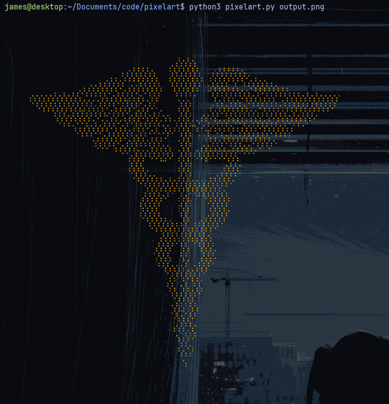
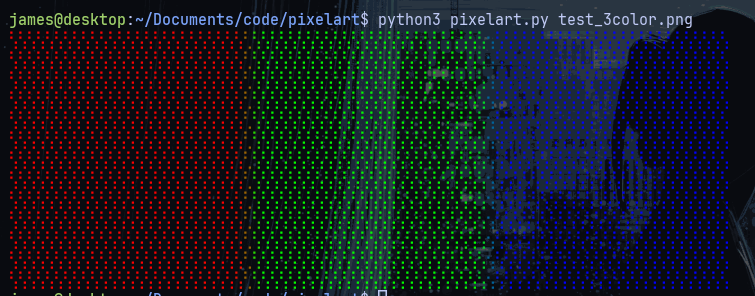

# pixelart

Convert images to colored Unicode braille art for terminal display.

## Installation

```bash
uv pip install pillow
```

## Usage

```bash
python3 pixelart.py <image_path> [target_columns]
```

- `image_path` - Path to your image file
- `target_columns` - Number of braille characters per row (default: 80)

Examples:

```bash
python3 pixelart.py photo.jpg           # 80 columns
python3 pixelart.py photo.jpg 120       # 120 columns (wider)
python3 pixelart.py photo.jpg 40        # 40 columns (narrower)
```

## How It Works

The script converts images to Unicode braille characters, where each braille cell represents a 2x4 grid of pixels:

```
Cell layout:     Bit positions:
  ● ●           [0][1]
  ● ●           [2][3]
  ● ●           [4][5]
  ● ●           [6][7]
```

Each braille character encodes 8 dots using the Unicode block U+2800 to U+28FF. The script:

1. Resizes the image to fit the target braille grid
2. Calculates intensity for each 2x4 pixel block
3. Applies ordered dithering using a 4x4 Bayer matrix
4. Maps lit dots to braille character bits
5. Colors each character using ANSI 24-bit color codes

## Examples

### Screenshot Demos


### Simple Gradient (test_3color.png)

A red-to-green-to-blue gradient converts to:

```
$python3 pixelart.py output.png
```                                                                              


```
$ python3 pixelart.py test_3color.png 
```


### Full Color Output

With ANSI color support (requires a modern terminal like iTerm2, Kitty, or Windows Terminal):

```bash
python3 pixelart.py output.png80
```

The output preserves the original colors using true 24-bit ANSI escape codes.

## Features

- **True color**: Uses ANSI 24-bit color (`\033[38;2;R;G;B`)
- **Transparency support**: Configurable alpha threshold
- **Background detection**: Auto-detects light/dark backgrounds
- **EXIF rotation**: Handles camera orientation metadata
- **Ordered dithering**: 4x4 Bayer matrix for smooth gradients

## Requirements

- Python 3
- Pillow (`uv pip install pillow`)
- Terminal with ANSI 24-bit color support
